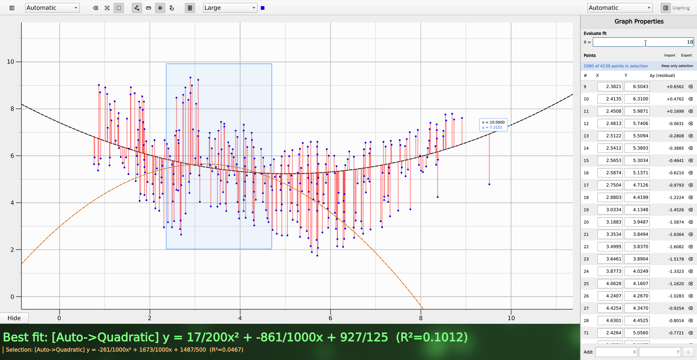

# Graphical
Simple Qt QML 6 application for line fitting. Supporting simple linear regression, quadratic regression and exponential regresion.
#### Try it live at https://graphical-web.pages.dev/

> Important note: As of right now, this app is considered finished and so I won't be providing much support to it, if you wish to continue development, please consider forking this repository.

# License
GNU GPL v3
